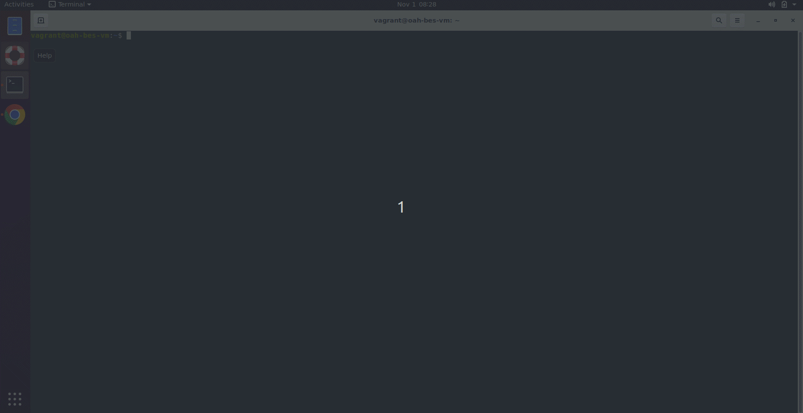
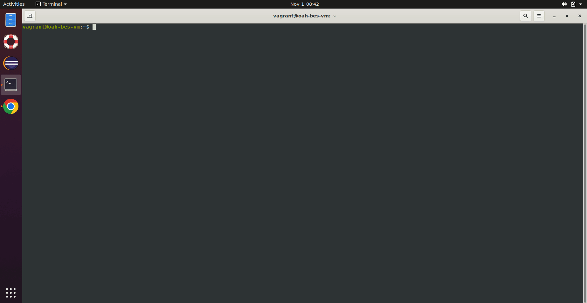
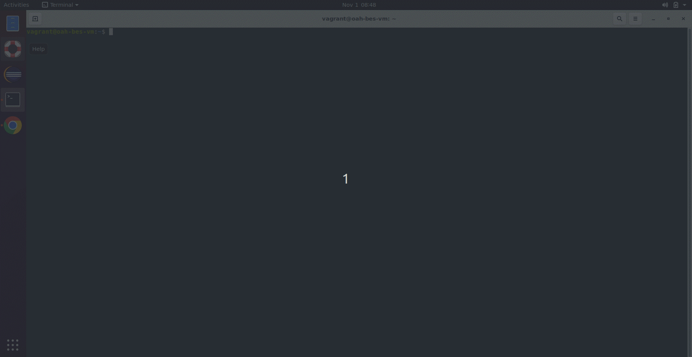
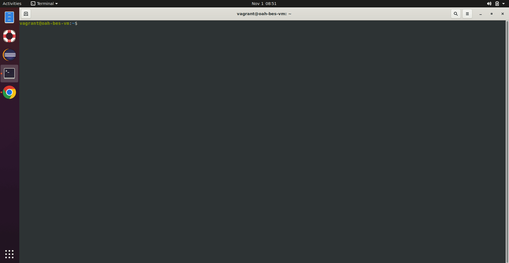
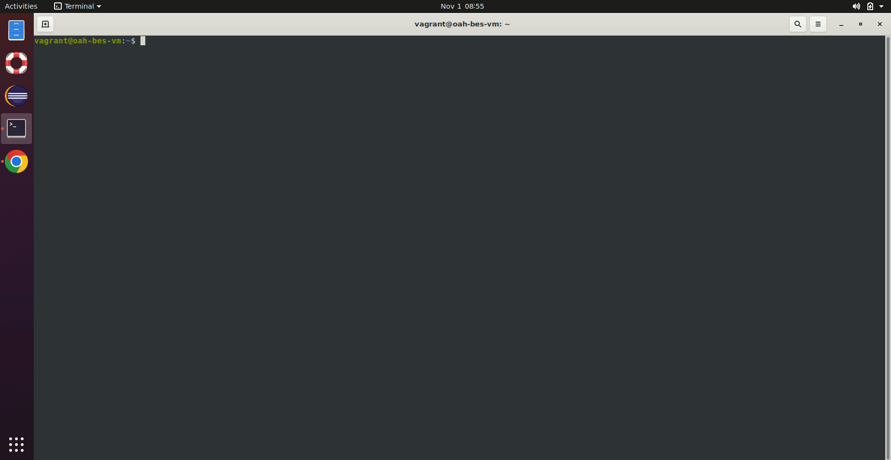

A substrate that brings up bundles of BeS & other tools that would enable users to fast-track their Red Teaming and Blue Teaming activities by significantly reducing the effort spent on setting up respective environments. oah-bes-vm helps to isolate the installation of BeS projects in a specific environment. According to the needs, user can configure oah-bes-vm during installation.

### Red Team (RT)
A group of people authorized and organized to emulate a potential adversary's attack or exploitation capabilities against an enterprise's security posture.

### Blue Team (BT)
The group is responsible for defending an enterprise's use of information systems by maintaining its security posture against a group of mock attackers (i.e., the Red Team).

### Usage scenarios:
1. **Security Analyst**: Security analysts are experts who identify and fix problems within security systems by analyzing risks, vulnerabilities, threats and incidents. They perform a ton of security analyses to recommend solutions for preventing cyberattacks. RT & BT activist / Security Analyst of BeS community can use oah-bes-vm to work on a specific open-source security project.

2. **BeSLab Manager**: oah-bes-vm helps BeSLab Manager & Security Analyst to analyse and do RT & BT activities of open-source security projects. After analyzing multiple open-source security projects using multiple static analysis tools (like SonarQube, Codeql, SBOM, etc) by BeSLab Manager, a security analyst can use oah-bes-vm to set up an isolated RT/BT environment for each specific open-source security project to do RT & BT activities.
([BeSLab Documentation](https://be-secure.github.io/Be-Secure/bes-beslab-details/))

## Features of oah-bes-vm
1. oah-bes-vm allows the user to set up RT & BT environment inside an Ubuntu-based virtual box.
2. User can install, remove, update, reset & validate RT & BT environment for a specific open-source security project as per requirements.
   - ### Install an environment
            bes install -env <environment name> -V <version>
     
     
   - ### Validate an environment
            bes validate -env <environment name>
     

   - ### Update an environment
            bes update -env <environment name>
     

   - ### Reset an environment
            bes reset -env <environment name>
     

   - ### Uninstall an environment
            bes uninstall -env <environment name>
     

    For more information check [BeSman documentation](https://be-secure.github.io/Be-Secure/bes-besman-details/).

## BeS Tools
- [BeSman](https://be-secure.github.io/Be-Secure/bes-besman-details/): People invest significant time and energy in the setup and configuration of open source projects on their local systems for evaluation or to begin working on them. However, they often encounter difficulties and setbacks related to configuration, requiring additional effort to resolve these issues. This substantial effort is primarily focused on getting the environment ready, rather than actually leveraging the existing open source project to develop new capabilities. It is important to find more efficient ways to manage this investment of effort. This is where the BeSman utility comes in, offering command-line functionality to swiftly and consistently provision tailored environments. 

##  How to bring up oah-bes-vm?

There are two modes to bring up oah-bes-vm.

1. Bring up VirtualBox & install BeS & other tools inside it.

2. Install all BeS & other tools directly to the host system without using VirtualBox.

### Steps

 **Install oah-shell**

1. Open your terminal

2. Install oah-shell

    ```curl -L https://raw.githubusercontent.com/Be-secure/oah-installer/master/install.sh | bash```

3. Confirm the installation oah-shell by executing the below command which would list various oah commands

    `oah`

4. Execute the below command to get the list of environments

    `oah list`

    **Note:** Make sure oah-bes-vm is listed. If not, execute step 2 and run the below command

    `source ${OAH_DIR}/bin/oah-init`


**Follow below steps to setup oah-bes-vm inside VirtualBox.**

##### Pre-requisites

* [VirtualBox](https://www.virtualbox.org/wiki/Downloads) 7.0 or latest
* [Vagrant](https://www.vagrantup.com/) 2.3.7 or latest
* [Ansible Core](https://docs.ansible.com/ansible/latest/installation_guide/intro_installation.html) 2.14.4 or latest

##### Execute the below command

    oah install -v oah-bes-vm
or

 **Execute below command to setup oah-bes-vm without using VirtualBox.**
  
    oah install -s oah-bes-vm

## How to use oah-bes-vm?
1. The user can use **BeSman** to set up RT/BT environment for a specific open-source security project. ([BeSman user guide](https://be-secure.github.io/Be-Secure/bes-besman-details/))

# FAQ

1. **What is oah-shell?**

    Ans: oah-shell is an open-source utility to set up oah-bes-vm.

2. **What is the default username & password for oah-bes-vm?**
    
    Ans: Username- vagrant & password- vagrant
